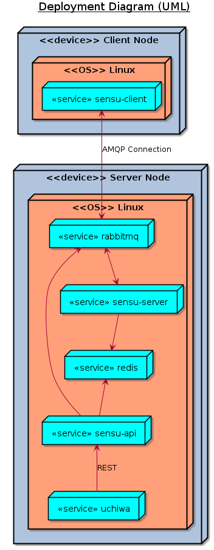

# What is it for?

An example [Sensu](https://sensuapp.org/) deployment.

## Server node
- create a server VM
- install and configure sensu-server along with dependencies
- install uchiwa

## Client node
- create a client VM
- install and configure sensu-client
- install example plugin

## Deployment diagram

# How to run?

#### vagrant

Just run `vagrant up` and open http://127.0.0.1:3000

#### docker-compose

Just run `docker-compose up` and open http://127.0.0.1:3000
